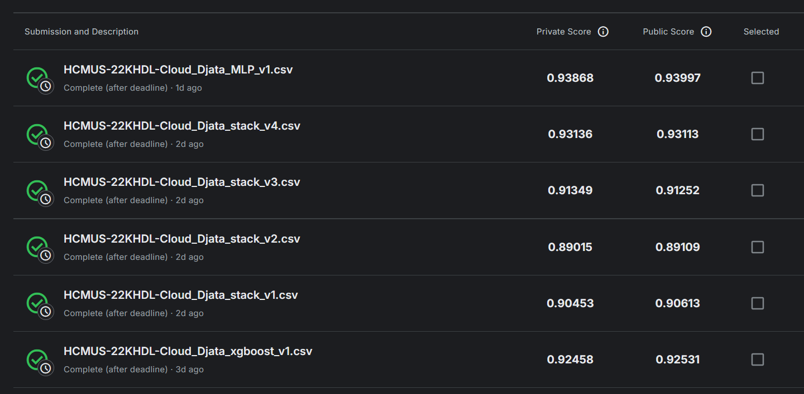

# ExploringMentalHealthData

## Goal

Build models to predict the target column ("Depression") for the Kaggle competition (Playground Series S4E11) using the provided synthetic survey dataset and produce submission CSVs.

## Data

Raw and processed data files are located in the `data/` directory, along with submission CSV files from the different models.

## Workflow

### 1. Data Preprocessing

**Script:** `scripts/data_preprocessing.ipynb`

**Steps:**
- Load the synthetic survey dataset.
- Convert binary categorical columns to 0/1.
- Manually process noise from categorical columns (except `Name`).
- Fill structural missing values.
- Impute actual missing values using various techniques, including mean, median, mode, K-Nearest Neighbors (KNN), and Weighted Random Sampling.
- Feature Engineering: Created one (1) new feature `Overall Stress Level` to better capture the cumulative stress experienced by individuals.
- Export the cleaned and processed dataset.

### 2. Training model: XGBoost

**Script:** `scripts/xgboost_training.ipynb`

**Steps:**
- Load the processed dataset.
- Normalize numerical features using StandardScaler.
- Encode categorical features using LabelEncoder.
- Calculate feature imbalance ratios.
- Split training dataset into folds for cross-validation.
- Train and cross-validate XGBoost model using the training folds.
- Calculate average performance metrics (F1-score, Precision, Recall, Accuracy).
- Train final XGBoost model on the entire training dataset.
- Generate predictions on the test dataset.
- Export submission CSV file.

### 3. Training model: Stacking Ensemble

**Script:** `scripts/stacking_ensemble_training.ipynb`

**Steps:**
- Load the processed dataset.
- Normalize numerical features using StandardScaler.
- Encode categorical features using LabelEncoder.
- Tune hyperparameters for base models using GridSearchCV
  - DecisionTreeClassifier
  - LinearSVC
  - SGDClassifier
  - LogisticRegression
  - PassiveAggressiveClassifier
- Create a StackingClassifier using the tuned base models and LogisticRegression as the meta-classifier.
- Split training dataset into folds for cross-validation.
- Train and cross-validate Stacking Ensemble model using the training folds.
- Calculate average performance metrics (F1-score, Precision, Recall, Accuracy).
- Train final Stacking Ensemble model on the entire training dataset.
- Generate predictions on the test dataset.
- Export submission CSV file.

### 4. Training model: MLP Classifier

**Script:** `scripts/mlp_training.ipynb`

**Steps:**
- Load the processed dataset.
- Normalize numerical features using StandardScaler.
- Encode categorical features using TargetEncoder.
- Tune hyperparameters for MLPClassifier using GridSearchCV. (Performed on Kaggle [notebook](https://www.kaggle.com/code/tdat94/mentalhealth-mlp-training) due to computational constraints)
- Split training dataset into folds for cross-validation.
- Train and cross-validate MLP Classifier model using the training folds.
- Calculate average performance metrics (F1-score, Precision, Recall, Accuracy).
- Train final MLP Classifier model on the entire training dataset.
- Generate predictions on the test dataset.
- Export submission CSV file.

## Results

